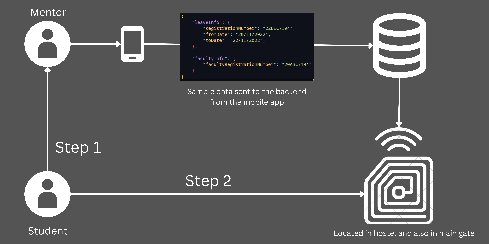
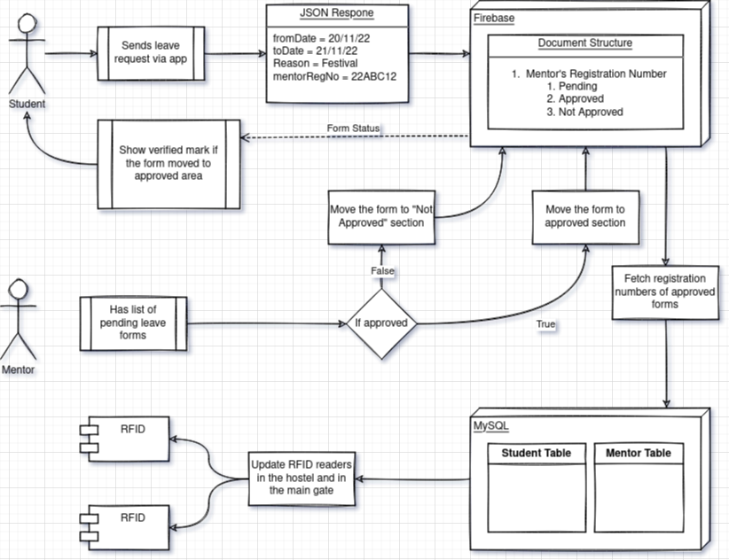

# Leave Pass Automation

The automated leave form aims to solve the manual and tideous work of taking the leave form and getting approval from security guards 2 times. It can be achieved by RFID tags which is provided in the student's identity cards.

# The database structure

### Student's Database
|S.No|Registration Number|Is Decrypt|Last Scanned|Mentor Registration Number|
|--|--|--|--|--|
|1|22BEC7194|1|20/11/2022|20ABC7194|
|2|&#@!#$shad|0|-|20XYZ4917|
|3|$@ASD!JN#|0|-|20MNO1234|

### Mentor's Database
|S.No|Mentor Registration Number|Public Key|Private Key|
|--|--|--|--|
|1|20ABC7194|&#@!#$leaf|##@!#$sprd|
|2|20XYZ4917|$@ASD!he2|ser@AD!JN#|
|3|20MNO1234|I$^%DS|SA@D@^#|

# Working

# Intended Use
1. Student requests for leave
2. Mentor approves the leave by decrypting the student's registration number in the **Student's Database** using his private key. 
	1. The process of decrypting is done automatically by the given app, and the faculty has to do nothing except to approve the leave for a specific registration number.

3. Now when the student scans the ID, the decrypted registration number matches with the scanned registration number, and now the gadget will show green light as approved, and stores the date of scanning.
4. When the student returns and scans the ID again, the current date is checked with the last scanned date in the database to ensure that the student didn't took any extra leave, if the program finds the student took extra leave, fine will be added accordingly.

# Hardware

1. Raspberry Pi powered by PoE
2. RFID module