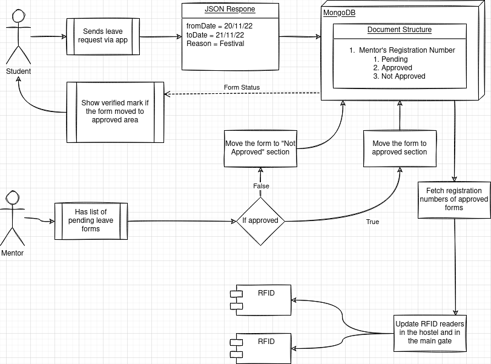

# RFID Leave Form

RFID leave form aims to solve the problem of  taking leave for holidays and outings by digitalizing the process using a mobile app and RFID reader in the hostel and main gate.

## The problem
Right now we have these following steps to take leave and to get out of the campus.

1. Email your mentor for approval of leave
2. Show the mentor's approval to your warden in your hostel
3. Fill up the leave form and get sign from your warden.
4. Fill up your details in a logbook in your hostel
5. Get a remark in your leave form from the security in the hostel
6. Again fill up your details in a logbook in the campus's main gate
7. Get a remark in your leave form from the security in the main gate

## The solution
Our project is here to skip most of the above steps and give a more productive workflow, the steps you need to take here is,

1. Fill out leave form using our mobile app
2. When leaving the hostel, scan your ID card in the RFID reader.
	1. The reader will show green light if your mentor approved your leave
	2. The reader will show red light if your mentor rejected your leave
	3. (Your leave form approval status will be shown in our app as well)
3. When leaving the main gate, scan your ID card in the RFID reader.
	1. This will follow a similar process as the step 2

As you can see, this increases the workflow of moving students out of campus, it will be very productive especially during festival seasons where many people want to move out. And with the current system, it is very inneficient and time consuming to complete all the work.

## Flow Chart

